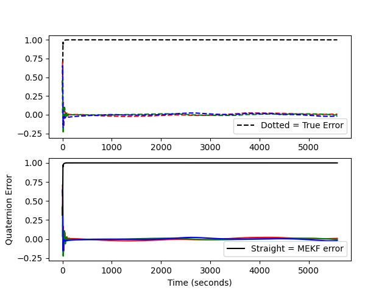
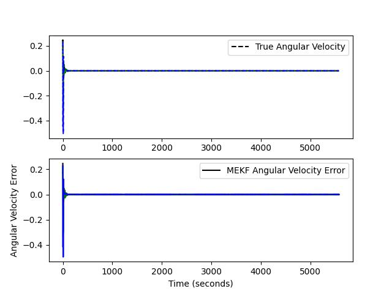
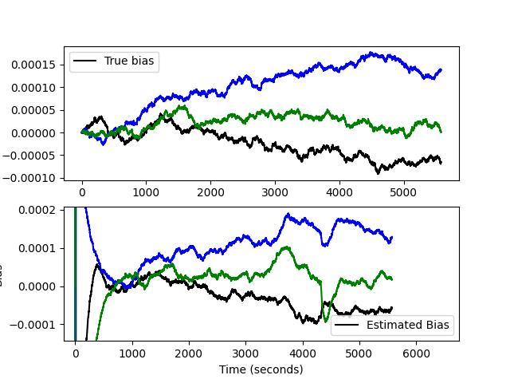
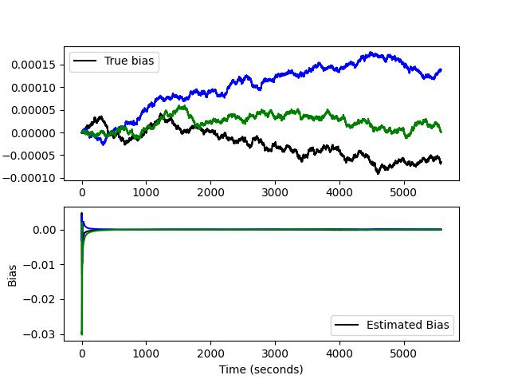

# Earth pointing satellite model

This is a personal project I've been working on in my spare time, while pursuing my MS with thesis at Virginia Tech. This is an attitude pointing model, where the satellite stays pointed towards the Earth for an amount of time. I utilize a multiplicative EKF with a sun sensor, magnetometer, and gyroscopes for attitude control. I also technically have a star tracker that outputs a quaternion directly; however, I decided to model these other sensors to better test the algorithm and because sometimes a star tracker isn't always used. The only issues that arise with the attitude control are during eclipse, when it is a little bit shaky; however, I may look into an Earth-horizon sensor instead of the sun sensor to deal with that. I have implemented a detumbling mode that now takes place before the pointing mode. I start by randomizing the initial quaternion value and the angular velocity vector (between 7-15 deg/s). Using the magnetic control law from the textbook, Fundamentals of Spacecraft Attitude Determination by Markley and Crassidis, the system detumbles to a "threshold" value, where once it reaches that, it's stable enough to begin pointing. The detumbling plot can be seen below:

where the satellite detumbles to the threshold value. Once this value is reached, the timestep is used to compute the sun sensor and magnetometer measurements, which are then used for TRIAD attitude determination. This then gives the current attitude estimate for when the detumbling is completed and allows the multiplicative EKF to do its job of pointing. The satellite may run into some very small divergences when an eclipse occurs, but it stays pretty accurate. The output plot for the attitude error can be seen below, where it converges at 0 for the quaternion vector and 1 for the scalar, with the MEKF tracking the true values. 

The eclipse can be seen to occur during the 0000-10000 second area, where it has a slight hiccup. Next, the angular velocity of the satellite can also be seen to approach 0 below:

Finally, the gyroscope bias plots can be seen below, where I have zoomed in on the MEKF estimate to show the accuracy compared to the true value and then also the zoomed-out version.

Currently, the detumbling phase is different for each run, where sometimes it takes a short amount of time to complete detumbling and sometimes longer. This is all dependent on the randomization that I mentioned at the beginning. I may also experiment with different combos of sensor models just to learn about each kind of sensor, but also, sensor combos are specific to mission needs, so I don't have a specific goal in mind for model accuracy. 

Plans moving forward:

I plan to add more modes next, such as a maneuver mode and a safe mode. I would also like to explore more external torques and model those, as well as refine my momentum desaturation technique, as it's somewhat basic currently. 
